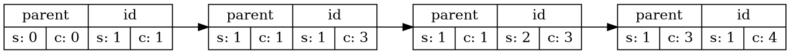
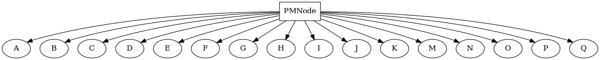

## RUMINATE - Program Design Document


# Motivation

Taking notes should be easy, but the simplicity of note should not belie it's power as a foundational data construct for much more complex data systems. Providing fundamental tools to manage and manipulate notes can create powerful tools that grow organically based on the needs of the note taker.

Provide easy to use note editing faculties
Note compositing system to create higher order documents from notes.
Database driven design to


# High Level Goals

Plugin system use data within ruminate other application, such as bash, powershell, browsers, rich text editors.

## 1. Note Engine
Each note is a unique data entity that can be composed into more complex forms using referenced formed from a simple query language system. Basic Text editing with a mono-space font, "sticky" note aesthetics to get the basic concept built. A uniform API for handling note data, allow implementation in other mediums. Text only processing. All text is treated the same, the interpretation is left to client implementation. Base client simple. Allow zoom functionality. Establish datatypes capable of handling multi-way merges from independent sites. Confirm the general UI for working with multiple notes, and integrated notes into different view types, such as tables, lists.

All ruminate data is stored in central store and accessed through a query language, making the data portion of ruminate a database system. Data retrived from queries is

## 2. Game Engine
Introduces new data primitives, pixel maps, and audio streams, and integrates a scripting language interpreter that can handle the transformation of primitives of different types. Integral physics systems and eventing systems handled dynamic state changes of primitives. Low level manipulation of primitives through scripting systems can allow emergant behaviours to be described.

## 3. Program Engine
Introduces a custom scripting language suitable for handling game engine / interactive systems. Refines the text rendering system to handle rich-text features. Include UI display features such as graphs.


# Section 1 : Note Engine

The core of ruminate is a note database engine that allows users the ability store, retrieve and distribute structured data, focused primarily on text data. Utilizing a simple query language and a string based programming interface, higher order application user interfaces can be constructed to interact with note data in various ways, such allowing user to edit note data, upload to remote Ruminate databases, combine note data from different sources, and present note information in non-textual forms.

## 1.1 : Note Data

In terms of Ruminate, a **note** is a structured data object comprised of the following:

- Universally Unique Identifier Field
- Organizational Identifier Field
- Last Modified Epoch Field
- A vector of zero or more tuples with the following fields
  - Key String Field
  - Value field of type Number or String
  - Last Write Vector Clock Field
- A causal data field for general structured data.  

The intent with this data structure is to provide a generalized data structure with which an adaptable query system can be implemented to retrieve and store note data
The base note type is a structure for holding textual data with tag information (provided by the tuple field).

### 1.1.1 Casual Data

**C**onflict-Free **R**eplicated **D**ata **T**ypes provide a solution to resolving concurrent edits from multiple remote sites. By carefully constructing a data system that inherently resolves edit conflicts, a distributed database can be reliably constructed, with minimal effort involved in ensuring synchronization across remote stores. All non-trivial data structures in ruminate utilize a form of CRDT in order to benefit from the properties of these data types.

----

Data atoms must have a present causal parent for it to be accepted. When it is inserted into the data structure it is placed amongst its peers once it's causal parent is located. If its parent is not present, the atoms total position cannot be assessed, and thus cannot be accepted into the data structure. The exception to this rule is on an initial atom, where the site id is sufficent to determine total ordering.

When placed within ordering amongst peers, data that cuasually occurs after cannot be present, as this would break the afformentioned inveriant. The causal history of any given atom must be traceable back to a root atom. This means only peer atoms are considered, even if the peer atoms have causal children present. The only thing that must be ensured is the peer must ordered according to site ID. Thus the placement of a peer atom is determined by it's site id. If, during placement, the peer atom encounters an atom with a lower placement value, we can be sure that atom has found it's correct location, since causaly atoms with lower placement values can only occure if the pear is less than the considered atom, or it is a non-peer that causally occurs after the considered atom's causal parent.

There are two main forms of CRDTs - State Based and Operational Based.
State based CRDT transmit an intire data state that can be merged with other states.
Operation based CRDT transmit opertions that mused be compared with the history of the local state to see if the operation can be applied given certain conditions.
Ruminate uses a form of Opertation based CRDTS for its large data structures, and state based for the tag data structure.
#### Operational G-Counter (Grow-only Counter)
N Nodes assigned a unique ID (0 through {N - 1})

### 1.1.2 Ruminate Base Causal Data types


### 1.1.2 Ruminate CR Text Data Type
Text data is a an insertion problem. Causal insertion must allow atoms to be inserted into the total ordering at any point. Order represents display appearance and position, with possible occlusion with the delete atom.

Ruminate's text data is a casual btree structure. The leaves are individual lines. Each line links to the next and previous line. insertions are performed through. Each line is comprised of atoms. each atom represents one of three things. insert value, remove proceeding value, insert line. Insertion is performed by identifying the line and the value to which to append a value.
Line Based BTree
Causal data operations
Automatic Merging


### 1.1.3 Tag Causal Data types

Uses resultant [Site ID, CLOCK] and result [Site ID, CLOCK]

Can id + clock be synthesized by walking the history backwards? Clock deltas.

Atom A
[[0,1]]
Atom B
[[0,0]]
Atom C
[[0,1]]

Pixel data is a stack problem.

Not only need to be concerned about order agreement, but also to worry whether the result makes sense or not,


### 1.1.3 CR Pixel Map Data Type
Pixel data is an add only problem.

 Causal insertion must allow an insertion to be correctly ordered, where order represents display precedence and possible occlusion. The atom unit used for a bitmap data is referred to as a panel. It is a 12 byte data structure storing the panel identifier, the causal panel identifier, color data, and panel size data. A single panel represents a $4^2$ grid, translating to a 16 pixel grid. Panels are grouped into $4^2$ panel groups that then are grouped into a hexa tree structure that comprises the entire image field of the CRDT Pixel Map structure. An additional datum used for a panel is it's node id, which is discarded when the panel is placed, but used when the panel is transmited alongsied the panel data to peer CRDT structures. The panel quad tree groups are not part of fundamental data the compromises a pixel map, but are created ad hoc when panel atoms are received. If a panel is stored outside a quadtree structure, node information MUST be included as part of the panel data.

A panel C would look something like this:

```c
struct PMPanel {
  id prev;
  id own;
  char[4] pixel_data;
  byte field;
}
```

Panels within a pixel map are used to describe an area of color data with which can be interprete as an image when the set of color areas is taken. The insertion of a panel atom is completed by a process that first considers the panels field position, which implies the local panel location the atom is located in. it is then ordered within that panel according to the ordering rules described bellow.

An atom's parent id is searched for within the group. if the parent Id is not found, then the atom is placed before the first atom who's id is higher than than the inserted atoms id. If the parent atom is found, then the atom is placed after the parent, and ordeered amongst it's peers bast on the site id, wherin higher sites are placed after lower site id's. It is also placed before any atom who's id is higher than it's own.

Clock resolves total ordering, site resolves clock ambiguity.



When processing a panel, the atoms are considered from most recent to least. Each atom contains a coverage bit field, which represents the area of that atoms color contribution to the 4x4 panel field. The resulting color is the  union of the coverage bit field with the color data. Since the last most atom represents the most recent write to the panel field, the subsequent coverage bitfields are the difference of the existing coverage and the atom's bitfield. This also means that if a the coverage field is completly covered by single atom or set of atoms, any more underlying atoms can be skipped, as their coverage contribution will be zero.


16 panels are grouped into a coverage leaf nodes, yielding a pixel area of $16^2$. The coverage nodes are then grouped into subsequently larger coverage fields based on a hex structure, which is a special form a of a btree for two dimensional fields. Field of coverage for a single pixel map is $256^2$ leaf nodes, yelding a side length of $256*16$ pixels. The center pixel node is placed at $[128_x,128_y]$. The pixel field grows up. so the first panel is added to a subsequent parent panel is the field coverage is expanded as more atoms are added.



```c
struct PMNode {
    int clock; // Clock data is derived from the top most clock of the
    bool IS_LEAF;
    PMNode[16];
    PMPanel *;
}
```

Panels can exist independent of any tree structures, as illustrated by the following struct

```c
struct PMStaticPanel {
  PMPanel panel;

}
```


Invairents, Order conflicts are resolved by
Clock ID
Site ID


This means that if A comes before B, and B's area of coverage overlaps part or all of A's area, the representation of A's contribution on the screen may be occlude by some or all of B's, up to the point were the consideration of A's contribution is not necessary. A future insertion can never be placed beneath an existing e insertion, except in the event of syncronizing from a source where the causal ordering forces an merged atom to occur before the current clock.


The two most important things with an insertion is when did it occure in the causul ordering, which is determined by the atom's cuasual parent, and the area of coverage of the atom.

The invariant A comes before B

Can uniqueness be generated from delta based data? IF the atoms causal parent data is omited, the atom cannot be held unique, but can the parent be determined by walking backword in the causual history.
Example
>[A][A, D][A, F][A, J]
To
[-A][A][D][F][I][J]
Meaning is lost
F=>A or F=>D
12 byte insertion Atom
So data must be [ID prev, own ID]
When optomizing for space, we can clear atoms completely occluded by future atoms.  if an atom comes in where both its id and parent id is less then the lowest atom, it is inserted into the bottom of the stack.

Causal Data operations
Implemented to facilitate the development of future phases.

Quadtree. Insert value, remove value. Value is a color and size. Deletion is performed by replacing a interior or leaf node with new value.

structure of atom
[id, historical id, <<index>, <square size>, <color value>>]

structure of Quadtree

node ->
  child a b c d
  atom pointer

### 1.1.4 Common operations on Causal data.

Client side deletion of history. History can be removed to preserve space. Servers should not delete data, or enforce a hard sync based on a specific clock to keep clients and peers synced.

Byzantine faults - Based on established history
Site verification - prevent unauthorized sites from loading data.

Clock slice


## 1.2 Database
Every implementation of Ruminate is itself an independent, replicatable database. Each Ruminate instance is assigned a Unique site Identifier and is.
Local clients can borrow an ID, which avoids an issue with running out of site identifiers. The client's Ruminate DB instance must resolve the ID to a unique site ID which can be used to distribute updates amongst peer DB instances.

### 1.2.1 Backing Stores

### 1.2.2 Synchronizing
#### 1.2.2.1 Sites

## 1.3 Query Interface

## 1.4 Fundamental User Interface

## References

Marc Shapiro, Nuno Preguiça, Carlos Baquero, Marek Zawirski. A comprehensive study of Convergent and Commutative Replicated Data Types. [Research Report] RR-7506, Inria – Centre Paris-Rocquencourt; INRIA. 2011, pp.50.
https://hal.inria.fr/inria-00555588/document
